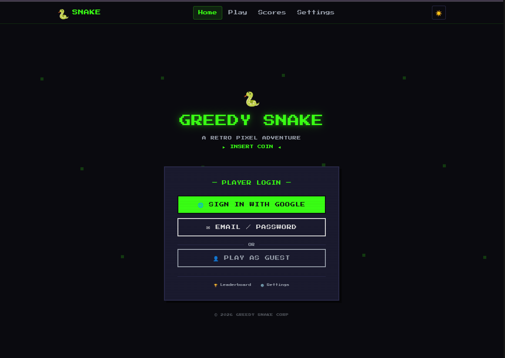
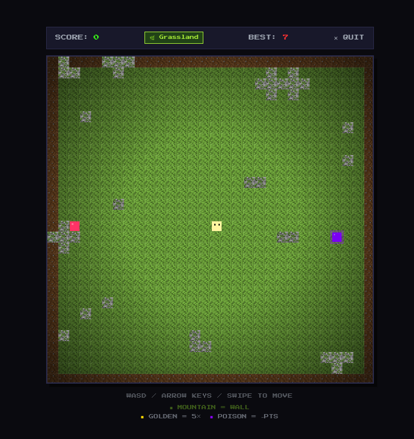
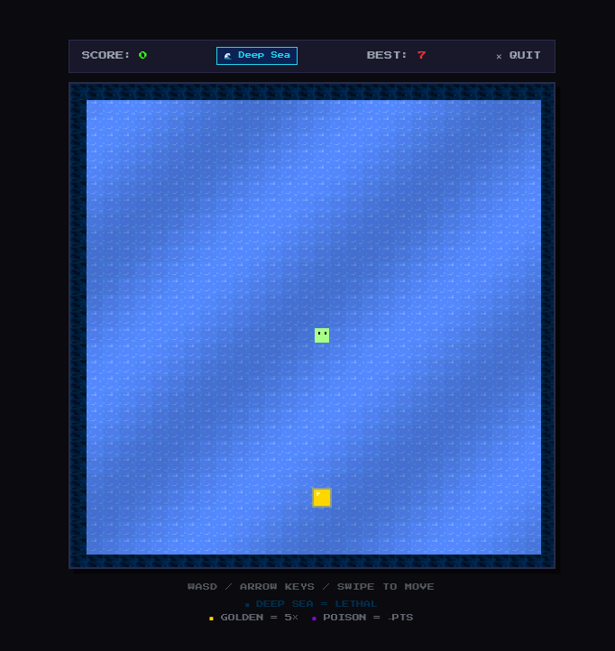
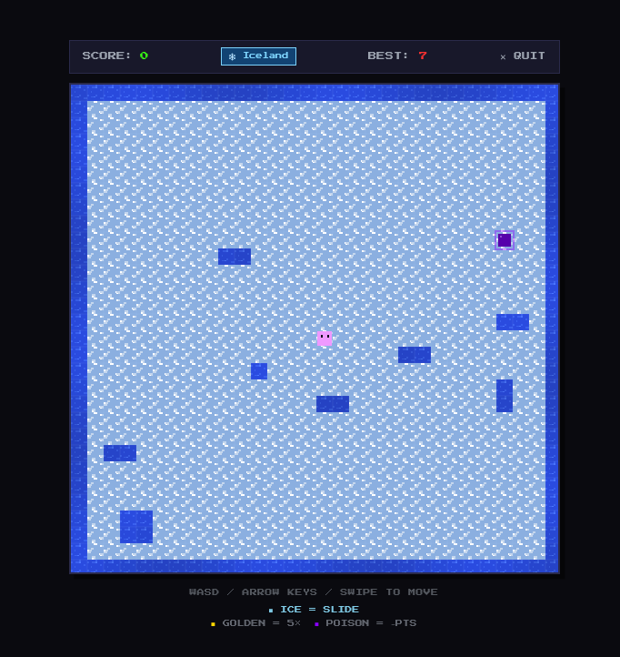
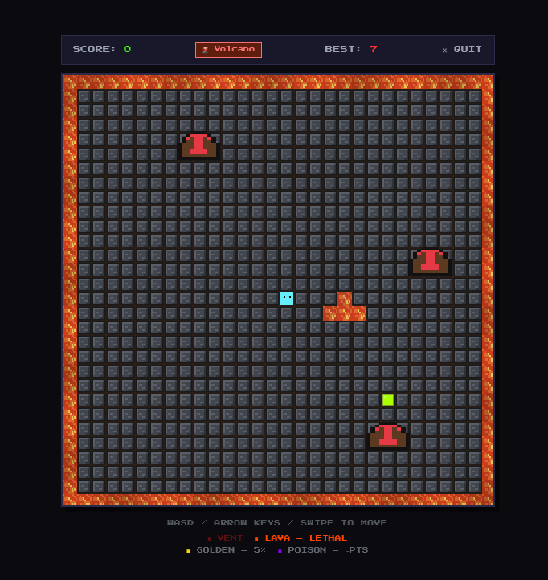
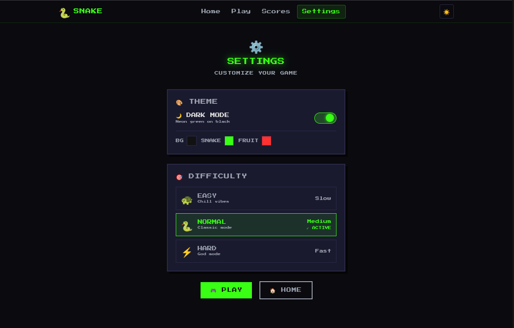
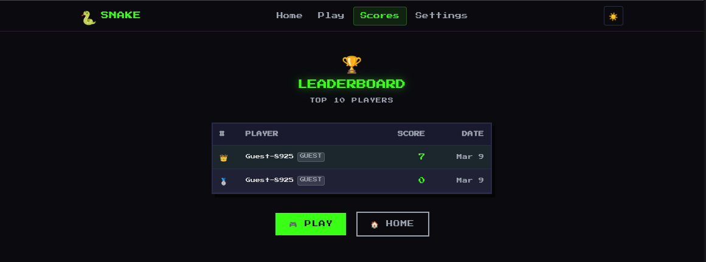

# 🐍 Greedy Snake: A Retro Pixel Adventure

Welcome to **Greedy Snake**, a modern take on the classic arcade experience. This web application features dynamic biome generation, multiple difficulty modes, and a global leaderboard to track the top players.

---

## 🎮 Game Preview

### 🏠 Landing Page
The journey begins at the **Landing Page**, where players can sign in via Google, use their email, or jump straight into the action as a guest.

### 🌍 Dynamic Biomes
Greedy Snake features a variety of environments, each with unique mechanics and visual styles:

| Biome | Description | Preview |
| :--- | :--- | :--- |
| **Grassland** | The classic experience. Watch out for mountain obstacles! |  |
| **Deep Sea** | Navigate the blue depths. The sea is lethal; stay within bounds! |  |
| **Iceland** | Slippery terrain where ice causes you to slide. |  |
| **Volcano** | High-stakes gameplay featuring lethal lava and vents. |  |

---

## 🛠 Features & Customization

### ⚙️ Settings & Difficulty
Tailor the game to your skill level. Whether you want "Chill vibes" on **Easy** or want to test your reflexes on **Hard (God Mode)**, the settings menu has you covered. You can also toggle **Dark Mode** for that neon-on-black aesthetic.

### 🏆 Leaderboard
Compete with players worldwide. The **Leaderboard** tracks the top 10 scores, letting you see where you stand in the rankings.

---

## 🚀 Getting Started

1. **Select your Biome**: Each game session generates a unique map.
2. **Choose Difficulty**: Easy, Normal, or Hard.
3. **Controls**: Use **WASD**, **Arrow Keys**, or **Swipe** to move.
4. **Objective**: Collect **Golden** fruits for 5x points, but avoid **Poison** and lethal obstacles like Lava or Deep Sea.